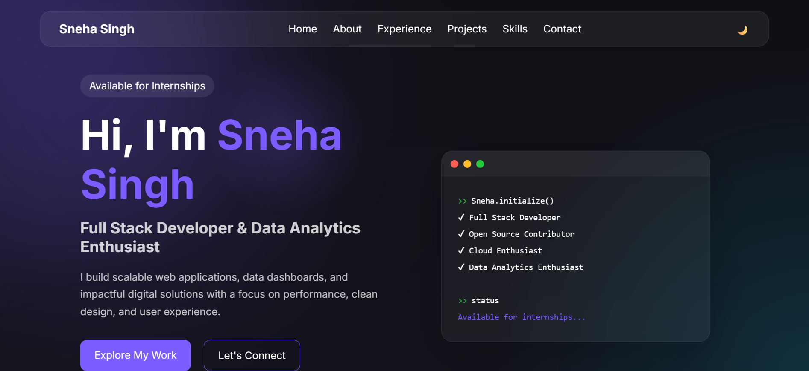

<h1 align="center">💼 Sneha's Personal Portfolio</h1>

<p align="center">
  A modern, minimal, and colorful personal portfolio website showcasing my skills, projects, and hobbies.  
  Designed to impress potential employers, clients, and friends with an interactive and responsive experience.  
  <br/>
  <a href="https://myselfsneha.github.io/sneha-portfolio"><strong>🌐 View Live Demo »</strong></a>  
  <br/><br/>
  
  
</p>

---

## 📸 Preview
<p align="center">
  
  <br/>
  <em>Landing page of my portfolio</em>
</p>

---

## ✨ Features
- 🎯 **Modern Design** – A clean, colorful, and minimal aesthetic.  
- 📱 **Fully Responsive** – Works smoothly on desktop, tablet, and mobile devices.  
- 🎨 **Dark Mode Toggle** – Switch between light and dark themes.  
- ✍ **About Me Section** – Showcasing education, passions, and hobbies.  
- 📂 **Projects Showcase** – Featuring my personal and collaborative works.  
- 📬 **Contact Form** – Allows visitors to reach me directly.  
- 🔗 **Social Links Integration** – Quick access to my profiles.

---

## 🛠 Tech Stack
| Component   | Technologies |
|-------------|--------------|
| Frontend    | HTML, CSS, JavaScript |
| Styling     | CSS Animations, Hover Effects |
| Design Tools| Figma, Canva |
| Hosting     | GitHub Pages |

---

## 🚀 Installation & Setup
```bash
# Clone repository
git clone https://github.com/myselfsneha/sneha-portfolio.git

# Move into folder
cd sneha-portfolio

# Open index.html in your browser

📌 Roadmap
 Portfolio completed with projects section

 Dark mode added

 Add animations for scrolling effects

 Integrate newsletter subscription form

🤝 Contributing
Got an idea for improvement? Feel free to fork this repo and submit a pull request!

📜 License
This project is licensed under the MIT License.

💬 Connect With Me
